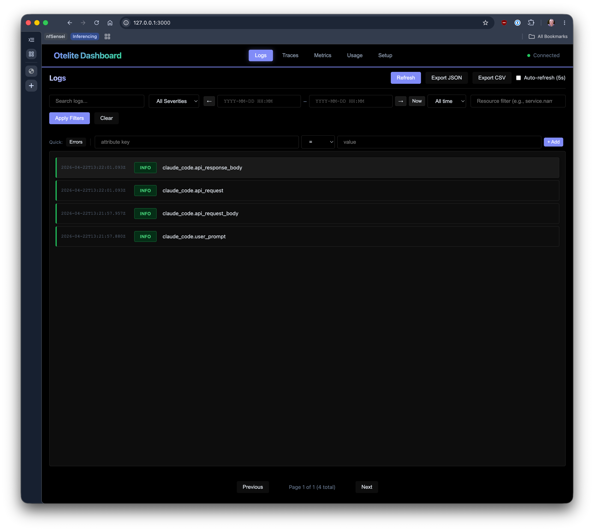
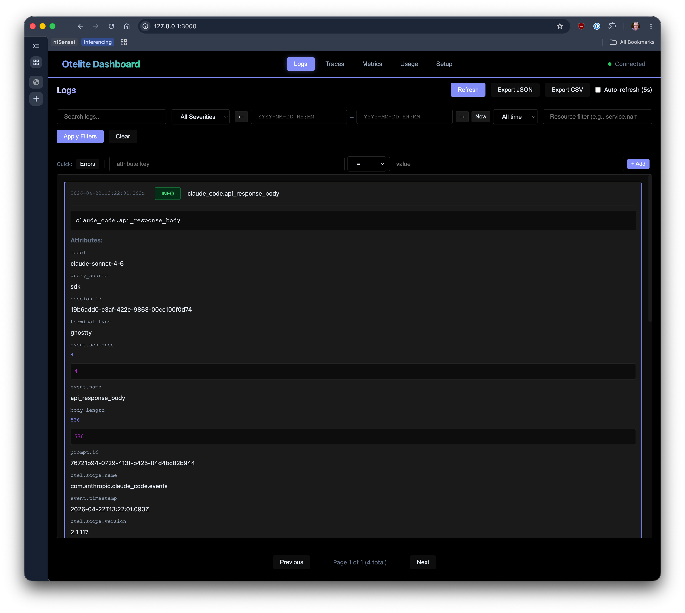
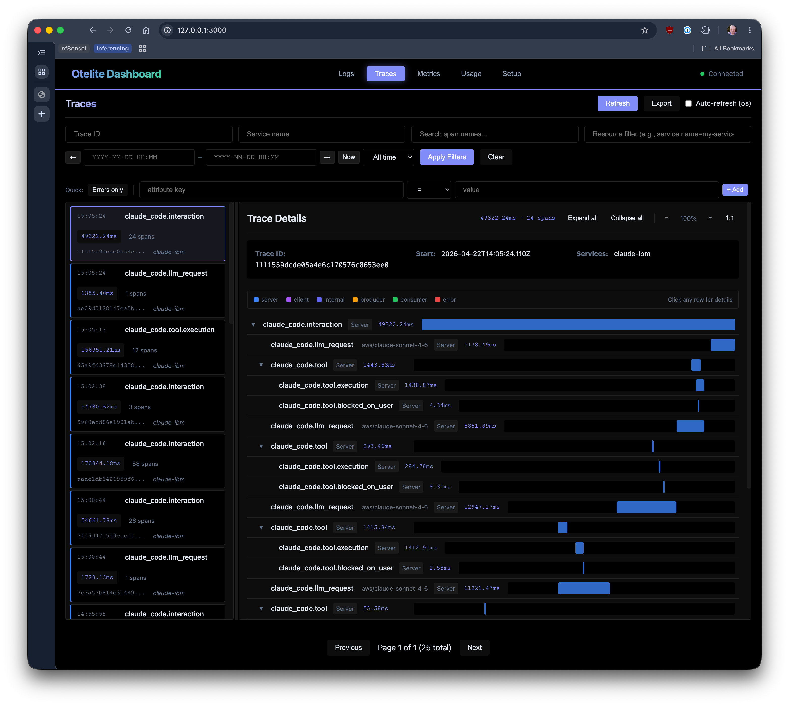
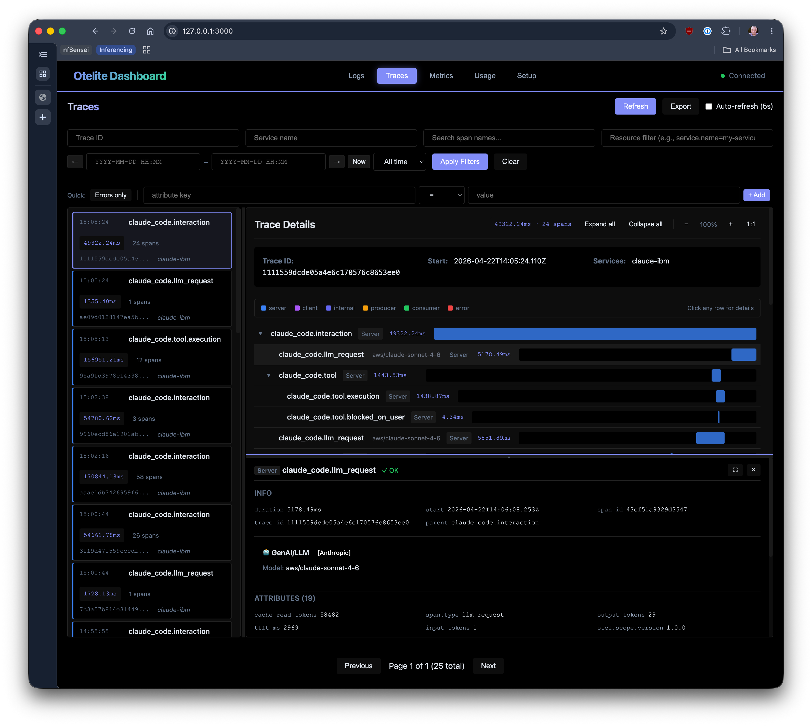
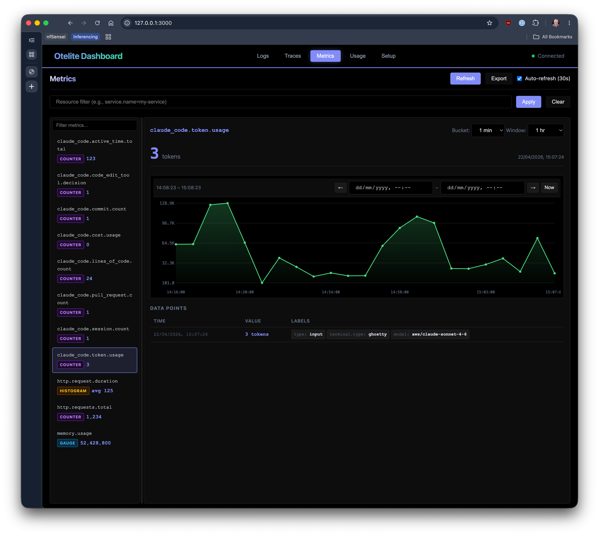
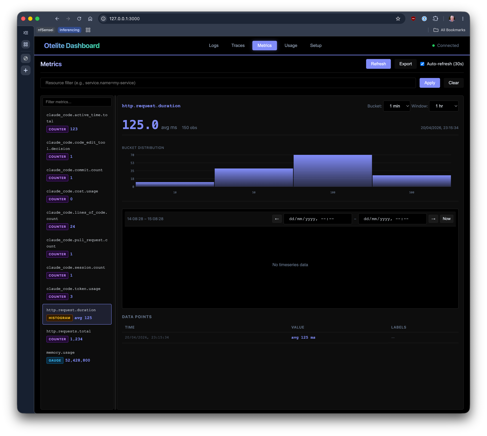
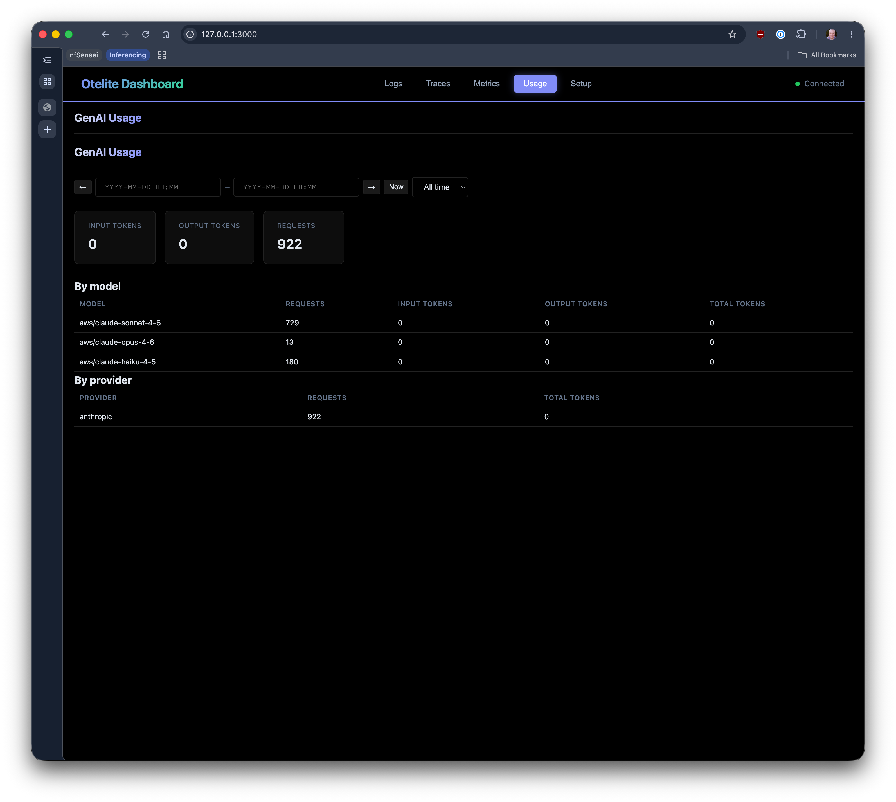
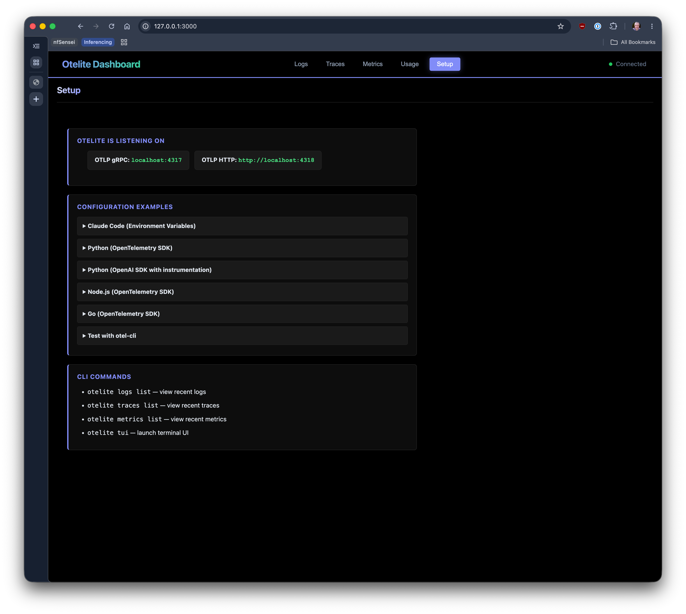

# Otelite

[](https://crates.io/crates/otelite)
[](https://github.com/planetf1/otelite/actions/workflows/ci.yml)
[](LICENSE)

**Lightweight OpenTelemetry receiver and dashboard for local development**

Otelite is a single-binary observability tool that receives OpenTelemetry data (logs, traces, metrics) and provides a web dashboard and terminal UI for viewing it. Designed for local LLM development with minimal resource usage (<100MB memory, <5% CPU), it starts in seconds and requires no external dependencies.

> **Personal project** — developed and maintained on a best-efforts basis by [@planetf1](https://github.com/planetf1). Not an official or supported product. Contributions and feedback welcome via GitHub issues and pull requests.

## Quick Start

```bash
cargo install otelite
otelite serve
```

That's it. `otelite serve` starts three services:
- **OTLP gRPC receiver** on `localhost:4317`
- **OTLP HTTP receiver** on `localhost:4318`
- **Web dashboard and REST API** on `http://localhost:3000`

Open `http://localhost:3000` in your browser to view telemetry.

## Features

- **Fast**: Starts in <3s, <100MB memory, <5% CPU idle
- **Full OTLP Support**: Metrics, logs, and traces via gRPC (4317) and HTTP (4318)
- **Embedded Storage**: SQLite-based, no external database required
- **Web Dashboard**: View and filter telemetry data at `http://localhost:3000`
- **Terminal UI**: Full-featured TUI with `otelite tui`
- **CLI**: Query and export data with `otelite logs`, `otelite traces`, `otelite metrics`, `otelite usage`
- **Offline import**: Load telemetry from JSONL files with `otelite import` — useful for CI artifacts and air-gapped environments
- **Single Binary**: Zero runtime dependencies
- **GenAI/LLM support**: First-class OTel GenAI semconv — token counts, cache hits, tool calls, model routing

## Screenshots

**Logs** — search, filter by severity, and inspect structured attributes




**Traces** — waterfall view with span-level timing and GenAI attributes (token counts, cache hits, TTFT)




**Metrics** — time-series counters and histogram bucket distribution




**Usage** — GenAI/LLM token and request summary by model and provider



**Setup** — live endpoint display and copy-paste configuration snippets for every SDK



> **The web dashboard isn't the only interface — don't miss the [Terminal UI](#terminal-ui) (`otelite tui`) and the [CLI](#cli-usage) (`otelite logs`, `otelite traces`, `otelite metrics`).** See the [TUI guide](docs/tui-quickstart.md) and [CLI reference](docs/cli-reference.md) for full documentation with examples.

## Sending Data

### Using otel-cli (easiest for testing)

```bash
# Install otel-cli
go install github.com/equinix-labs/otel-cli@latest

# Send a test trace
otel-cli exec --endpoint http://localhost:4318 --protocol http/protobuf -- echo "hello"
```

### Python

```python
from opentelemetry import trace
from opentelemetry.exporter.otlp.proto.grpc.trace_exporter import OTLPSpanExporter
from opentelemetry.sdk.trace import TracerProvider
from opentelemetry.sdk.trace.export import BatchSpanProcessor

trace.set_tracer_provider(TracerProvider())
otlp_exporter = OTLPSpanExporter(endpoint="http://localhost:4317", insecure=True)
trace.get_tracer_provider().add_span_processor(BatchSpanProcessor(otlp_exporter))

tracer = trace.get_tracer(__name__)
with tracer.start_as_current_span("my-operation"):
    # Your code here
    pass
```

### Rust

```rust
use opentelemetry_otlp::WithExportConfig;

let tracer = opentelemetry_otlp::new_pipeline()
    .tracing()
    .with_exporter(
        opentelemetry_otlp::new_exporter()
            .tonic()
            .with_endpoint("http://localhost:4317")
    )
    .install_batch(opentelemetry_sdk::runtime::Tokio)?;
```

### JavaScript/Node.js

```javascript
const { NodeSDK } = require('@opentelemetry/sdk-node');
const { OTLPTraceExporter } = require('@opentelemetry/exporter-trace-otlp-grpc');

const sdk = new NodeSDK({
  traceExporter: new OTLPTraceExporter({ url: 'http://localhost:4317' }),
});
sdk.start();
```

### Go

```go
import (
    "go.opentelemetry.io/otel/exporters/otlp/otlptrace/otlptracegrpc"
    "go.opentelemetry.io/otel/sdk/trace"
)

exporter, _ := otlptracegrpc.New(ctx,
    otlptracegrpc.WithEndpoint("localhost:4317"),
    otlptracegrpc.WithInsecure(),
)
tp := trace.NewTracerProvider(trace.WithBatcher(exporter))
```

## CLI Usage

```bash
# Start the server (foreground)
otelite serve

# Start as background daemon
otelite start

# Stop daemon
otelite stop

# Restart daemon (picks up recompiled binary)
otelite restart

# Check daemon status
otelite status

# List recent logs
otelite logs list --severity ERROR --since 1h

# Search logs
otelite logs search "database timeout"

# List traces with duration filter
otelite traces list --min-duration 1s

# Show trace details
otelite traces show <trace-id>

# List metrics
otelite metrics list --name "http_*"

# Token usage summary (GenAI/LLM)
otelite usage --since 24h
otelite usage --since 7d --by-model

# JSON output for scripting
otelite --format json logs list | jq '.[] | select(.severity == "ERROR")'
```

See [docs/cli-reference.md](docs/cli-reference.md) for the full reference with real example output.

## Terminal UI

```bash
# Start TUI (connects to localhost:3000 by default)
otelite tui

# Connect to custom API URL
otelite tui --api-url http://localhost:3000
```

**Keyboard shortcuts:**
- `l` / `t` / `m` — switch to Logs / Traces / Metrics view
- `Tab` / `Shift+Tab` — cycle between views
- `↑` / `↓` or `j` / `k` — navigate items
- `PgDn` / `PgUp` — page through list / scroll detail panels
- `Enter` — open detail / span waterfall
- `/` — search
- `f` — filter
- `?` — help
- `q` — quit

See [docs/tui-quickstart.md](docs/tui-quickstart.md) for the full guide with ASCII mockups of each view.

## REST API

```bash
# List logs
curl "http://localhost:3000/api/logs?severity=ERROR&limit=50"

# List traces
curl "http://localhost:3000/api/traces?min_duration_ns=1000000"

# Get trace with spans
curl "http://localhost:3000/api/traces/<trace-id>"

# List metrics
curl "http://localhost:3000/api/metrics?name=http_requests_total"

# Token usage (GenAI/LLM)
curl "http://localhost:3000/api/genai/usage?start_time=<ns>&end_time=<ns>"

# Health check
curl "http://localhost:3000/api/health"
```

## Development

Issues and feature requests are tracked on [GitHub Issues](https://github.com/planetf1/otelite/issues).

```bash
# Clone and build
git clone https://github.com/planetf1/otelite.git
cd otelite
cargo build --workspace

# Run directly from source
cargo run -p otelite -- serve

# Run tests
cargo test --workspace

# Run quality gates
cargo clippy --workspace --all-targets -- -D warnings
cargo fmt --check
```

See [CONTRIBUTING.md](CONTRIBUTING.md) for development workflow and [docs/testing.md](docs/testing.md) for testing guide.

## Architecture

```
┌─────────────────────────────────────────────┐
│         Web Dashboard (port 3000)           │
│         + REST API (otelite-api)            │
└─────────────────┬───────────────────────────┘
                  │
┌─────────────────▼───────────────────────────┐
│       SQLite Storage (otelite-storage)      │
│            with FTS5 search                 │
└─────────────────▲───────────────────────────┘
                  │
┌─────────────────┴───────────────────────────┐
│       OTLP Receivers (otelite-receiver)     │
│    gRPC (4317) + HTTP (4318)                │
└─────────────────────────────────────────────┘
```

**Crate structure:**
- `otelite-core` — Domain types (LogRecord, Span, Metric, Resource, GenAiSpanInfo)
- `otelite-storage` — SQLite backend with async trait
- `otelite-receiver` — OTLP gRPC and HTTP ingest
- `otelite-api` — REST API and web dashboard
- `otelite-client` — HTTP client for the REST API
- `otelite-tui` — Terminal user interface
- `otelite` — CLI binary (`serve`, `logs`, `traces`, `metrics`, `usage`, `tui`)

See [docs/architecture.md](docs/architecture.md) for detailed design.

## Performance

| Metric | Target | Typical |
|--------|--------|---------|
| Memory (idle) | <100MB | ~50MB |
| CPU (idle) | <5% | ~2% |
| Startup time | <3s | ~1.5s |
| Throughput | 1000 events/s | 2000+ events/s |

## Project Status

**Current version:** 0.1.0 — early release, core features stable. REST API may evolve.

## License

Apache License 2.0 — see [LICENSE](LICENSE)
